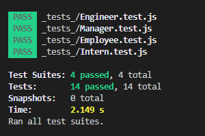

# TeamProfileGenWP

# Description
    * This is a Node app that generates a team profile HTML page.

# Install
    * Extract the files and run npm i.

# Usage
    * After running npm i, you type 'node index.js' and you will be presented with a series of questions.
    * After filling out the manager portion, you will be asked to add an additional team member or end the app.
    * If you chose to add another member, you will be presented with another series of questions specific to the type of 
    employee you selected.
    * When you've entered in all the information, an HTML page will be generated with employee cards displaying the info. 

# Tests

# Questions
    * Email: wpapp90@gmail.com
    * Github: wrp90

 